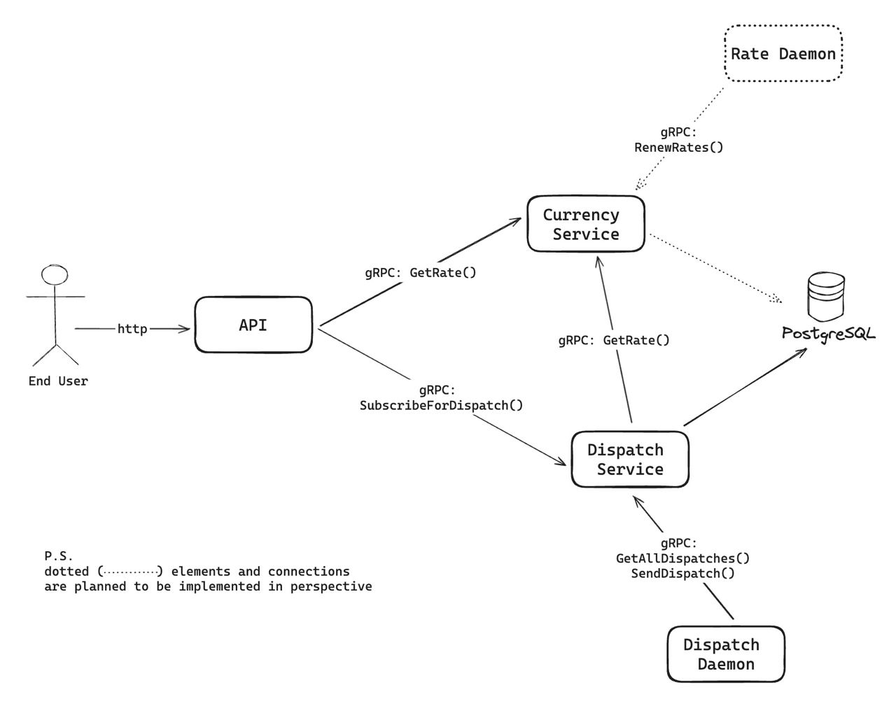

# Subscription API

API allows:
- find out current exchange rate of USD in UAH
- subscribe email address to currency rate change dispatch

## Used technologies

- __[Go](https://go.dev/)__ as main language.
- __[gin](https://gin-gonic.com/docs/)__ as web framework.
- __[mockery](https://vektra.github.io/mockery/latest/)__ for generation of interface mocks.
- __[PostgreSQL](https://www.postgresql.org/)__ as main storage.
- __[gRPC](https://grpc.io/)__ for inter-service communication.
- __[ExchangeRate-API](https://www.exchangerate-api.com/)__, __[Currency Beacon API](https://currencybeacon.com/)__ and __[Free Currency API](https://github.com/fawazahmed0/exchange-api)__ as third-party APIs for currency rate info.

## Quick start

1. Copy example env file with command below:
```
cp ./.env.example ./.env
```
2. Get API key from [third-API](https://app.exchangerate-api.com/) and set to `EXCHANGE_CURRENCY_API_KEY` value in `.env`.
3. Update `SMTP_EMAIL` and `SMTP_USERNAME` values in `.env`.
4. Get app password from Google ([instruction](https://support.google.com/mail/answer/185833?hl=en)) and set to `SMTP_PASSWORD` value in `.env`.
5. Start project with command (uses docker) below:
```
make start
```


## System design


### Processes

Keeping in mind 6th factor __Processes__ of _12-factor App_ I splitted app functionality into separate processes:

1. ___Gateway___ is an entry point for external users of `SubscriptionAPI`. It is web server and\
makes requests via gRPC to services for required functionality. For now it allows \
to get exchange rate USD/UAH and subscribe user for daily dispatch of USD/UAH exchange rate.

2. ___Currency Service___ is responsible for fetching currency rates from third-party API. \
In perspective as business requirements grow it will cache rates in some store or \
calculate/aggregate currency-related data.

3. ___Dispatch Service___ is responsible for subscribing users to dispatches, \
sending of dispatches thorough SMTP server to subscribers, and getting info about dispatch.\
In perspective it would be able to create dispatches, change dispatches, \
customize subscriptions etc.

4. ___Dispatch Daemon___ is an automatic process that gets info about dispatches, \
schedules them, and invokes their sending.

5. _[not implemented yet]_ ___Rate Daemon___ is an automatic process that invokes \
updating of exchange rates.

#### Per service documentation
1. [Dispatch Daemon](./daemon/dispatch)
2. [Gateway](./gateway)
3. [Currency Service](./service/currency)
4. [Dispatch Service](./service/dispatch)

## TODO
1. Implement rate daemon
2. Send welcome email when user subscribes for dispatch
4. to be continued...
