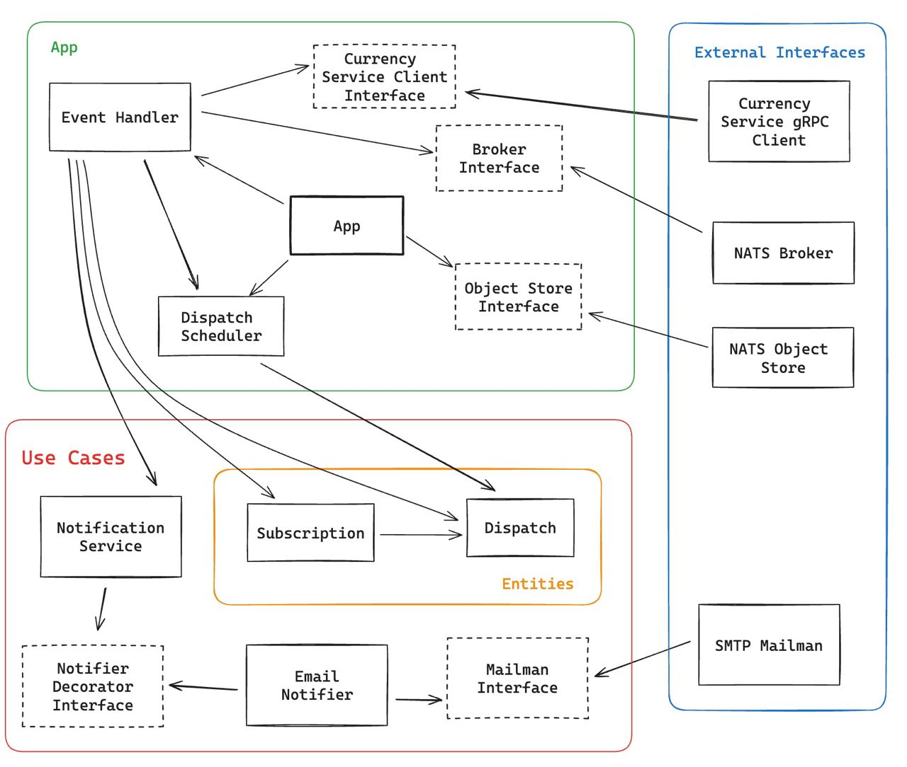

# Notification Service

## Description

Service monitors subscription-related events and sends appropriate notifications for users (e.g. on subscription created sends email with details of subscription).
Also service is responsible for scheduling of dispatches that have at least one subscriber. It consumes event of creation of subscription and adds/updates job for cron scheduler.

## Architecture

## Tests

There are implemented only dependency tests, but in pregress there will be unit and integration tests.
